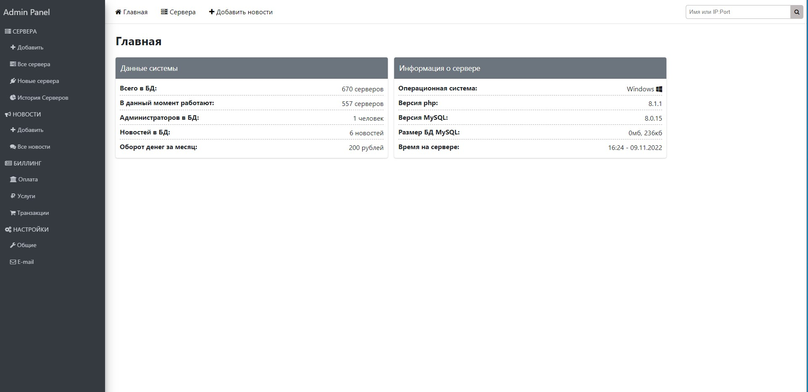

## Database MSQL 
```
php artisan migrate 
```
## Create user login admin panel. 
```
php artisan tinker 
```
```
DB::table('users')->insert(['name'=>'admin','email'=>'admin@admin.com','password'=>Hash::make('123456')]) 
```




